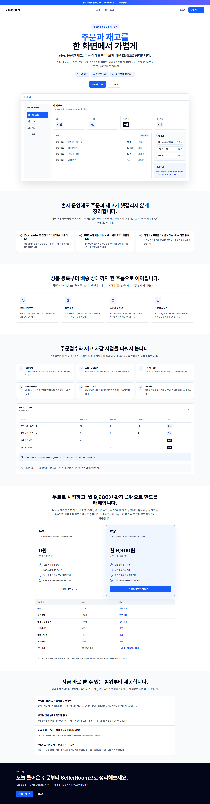
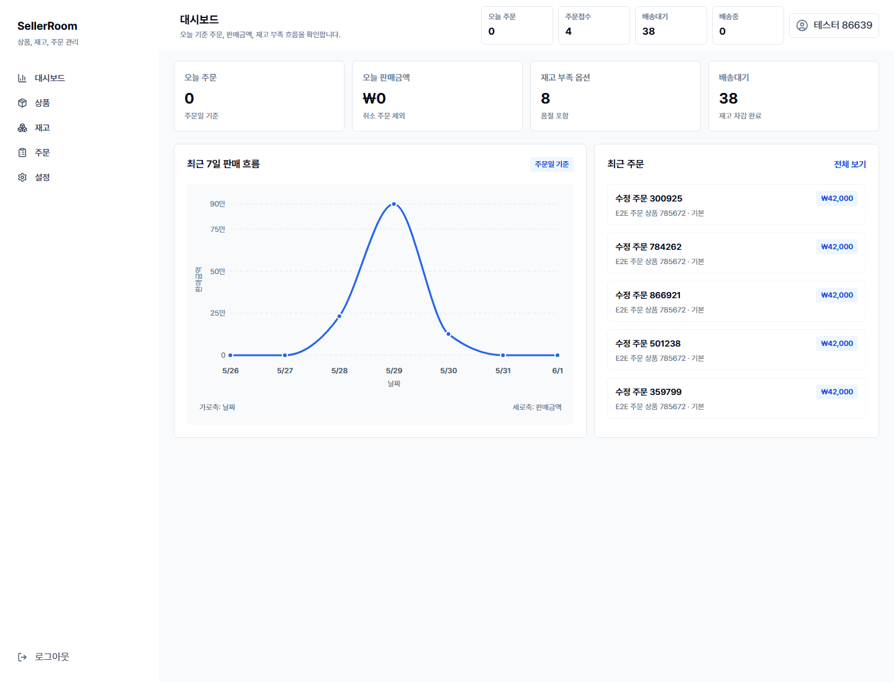
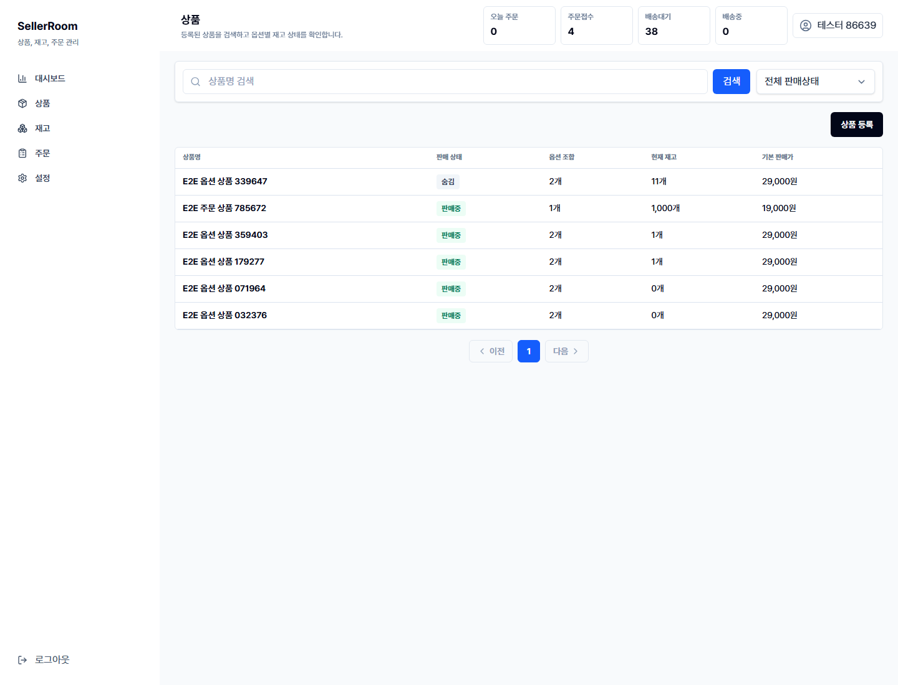
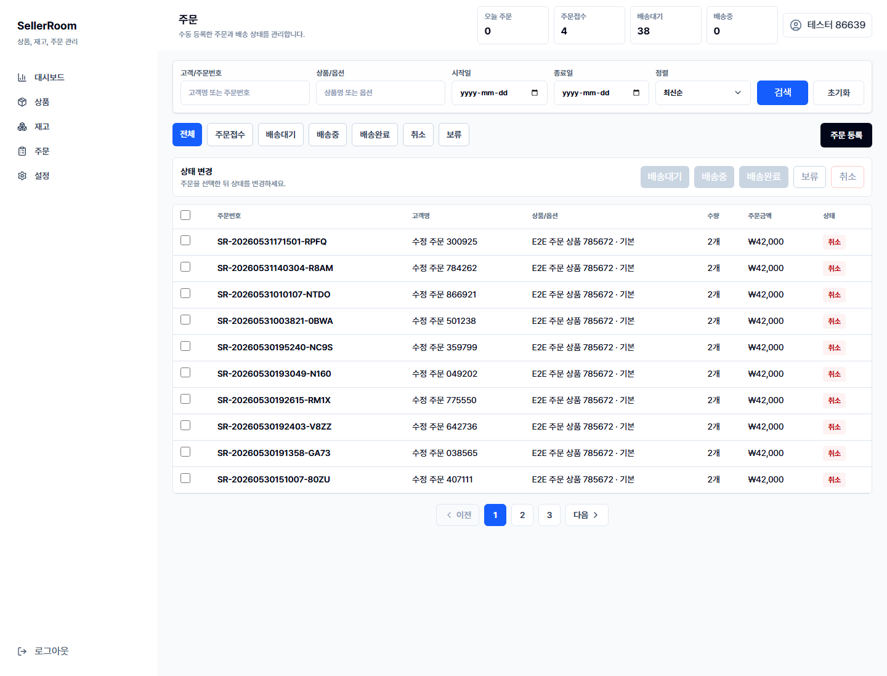

# SellerRoom

<p align="center">
  <strong>초기 1인 셀러를 위한 상품, 재고, 주문 운영 관리 서비스</strong>
</p>

<p align="center">
  엑셀과 메모장에 흩어진 상품, 옵션별 재고, 주문 상태를 한 화면에서 가볍게 정리합니다.
</p>

<p align="center">
  
  
  
</p>

<p align="center">
  <a href="https://setter-moon-front.vercel.app" target="_blank" rel="noopener noreferrer">서비스 화면 보기</a>
</p>



## 서비스 소개

SellerRoom은 스마트스토어, 쿠팡, 인스타그램, 카카오톡, 오프라인 판매처럼 이미 사용 중인 판매 채널의 운영 정보를 한곳에 모아 보는 내부 관리 도구입니다.

쇼핑몰을 새로 만들거나 결제, 정산, 환불을 대신 처리하는 서비스가 아닙니다. 큰 커머스 솔루션을 쓰기 전 단계의 1인 셀러가 상품, 옵션별 재고, 주문 상태를 빠르게 정리할 수 있도록 돕는 가벼운 운영 보조 도구입니다.

## 이런 셀러에게 맞습니다

- 혼자 상품과 주문을 관리하는 초기 1인 셀러
- 같은 상품을 색상, 사이즈, 용량, 구성 옵션으로 나눠 판매하는 셀러
- 여러 판매 채널에서 들어온 주문을 수동으로 정리하는 셀러
- 엑셀, 메모장, 카카오톡, 쇼핑몰 관리자 화면을 오가며 재고를 맞추는 셀러
- 복잡한 ERP보다 바로 이해되는 작은 운영 화면이 필요한 셀러

## 핵심 가치

```txt
상품 등록
  -> 옵션 조합 생성
  -> 옵션별 현재 재고와 안전 재고 관리

주문 등록
  -> 주문접수 상태로 저장
  -> 예약 수량과 가용 재고 확인

배송대기 전환
  -> 실제 재고 차감
  -> 재고 이력과 주문 상태 이력 기록

대시보드 확인
  -> 오늘 주문, 판매금액, 재고 부족, 최근 주문 흐름 확인
```

## 현재 구현된 화면

| 대시보드 | 상품 관리 |
|---|---|
|  |  |

| 주문 관리 |
|---|
|  |

## 현재 제공하는 기능

### 상품 관리

- 상품 목록 조회
- 상품명 검색
- 판매 상태 필터
- 상품 등록
- 상품 상세 확인
- 상품 기본 정보 수정
- 상품 판매 상태 변경
- 옵션 조합별 재고 확인
- 옵션 조합 사용 여부 관리

### 재고 관리

- 전체 옵션별 재고 목록 확인
- 현재 재고, 예약 수량, 가용 재고 확인
- 부족 재고 확인
- 재고 조정
- 재고 변경 이력 확인
- 주문 상태 변경에 따른 판매 차감, 취소 복구 이력 기록

### 주문 관리

- 주문 목록 조회
- 고객명, 주문번호, 상품명 검색
- 주문일 기간 조회
- 상태별 필터
- 주문 등록
- 주문 상세 확인
- 주문 수정
- 단건 상태 변경
- 다건 상태 변경
- 주문 상태 변경 이력 확인
- 주문 내용 수정 이력 확인

### 운영 화면

- 오늘 주문 수 확인
- 오늘 판매금액 확인
- 배송대기 주문 확인
- 재고 부족 옵션 확인
- 최근 7일 판매 흐름 확인
- 최근 주문 확인
- 계정 정보 관리
- 스토어 운영 설정 관리
- 무료 한도 사용량 확인

## 주문과 재고 흐름

SellerRoom은 주문이 들어오는 순간과 실제 재고가 줄어드는 순간을 분리합니다.

```txt
주문접수
  아직 실제 재고를 차감하지 않습니다.
  주문 수량은 예약 수량으로 계산합니다.

배송대기
  포장 준비가 시작된 상태로 보고 실제 재고를 차감합니다.

배송중 / 배송완료
  배송 진행 상태만 관리합니다.

취소 / 보류
  주문 상태를 정리합니다.
  실제 환불, 교환, 반품 처리는 판매자가 사용하는 외부 판매 채널에서 진행합니다.
```

## 무료 플랜 기준

초기 1인 셀러가 부담 없이 운영을 시작할 수 있도록 무료 플랜을 기준으로 설계했습니다.

| 항목 | 무료 플랜 |
|---|---:|
| 상품 | 10개 |
| 옵션 조합 | 100개 |
| 월 신규 주문 등록 | 300건 |
| 스토어 관리 | 제공 |
| 재고 관리 | 제공 |
| 배송 상태 관리 | 제공 |
| 대시보드 | 제공 |

확장 플랜 후보는 월 9,900원이며, 기본 기능을 잠그기보다 상품, 옵션 조합, 월 주문 등록 한도를 넓히는 방향으로 기획했습니다.

## MVP 범위

현재 MVP는 초기 셀러가 직접 입력하고 확인하는 운영 흐름에 집중합니다.

포함하는 범위:

- 랜딩, 회원가입, 로그인, 온보딩
- 대시보드, 마이페이지, 설정
- 상품 목록, 등록, 상세, 수정, 숨김
- 옵션 조합과 옵션별 재고
- 재고 목록, 부족 재고, 재고 이력
- 주문 목록, 등록, 상세, 수정
- 주문 단건/다건 상태 변경
- 무료 플랜 사용량 확인

제외하는 범위:

- 외부 판매 채널 API 자동 연동
- 결제 자동화
- 정산, 마진, 손익 계산
- 팀원 초대와 계정 공유
- 여러 스토어 전환
- 실제 택배사 송장 연동
- 교환, 반품, 환불의 금전 처리 자동화

## 제품 포지션

SellerRoom은 카페24나 스마트스토어 같은 큰 커머스 플랫폼을 대체하려는 서비스가 아닙니다.

초기 1인 셀러가 본격적인 쇼핑몰 운영 도구를 쓰기 전, 상품과 주문, 옵션별 재고를 가볍게 정리하는 첫 번째 운영 도구를 지향합니다.
